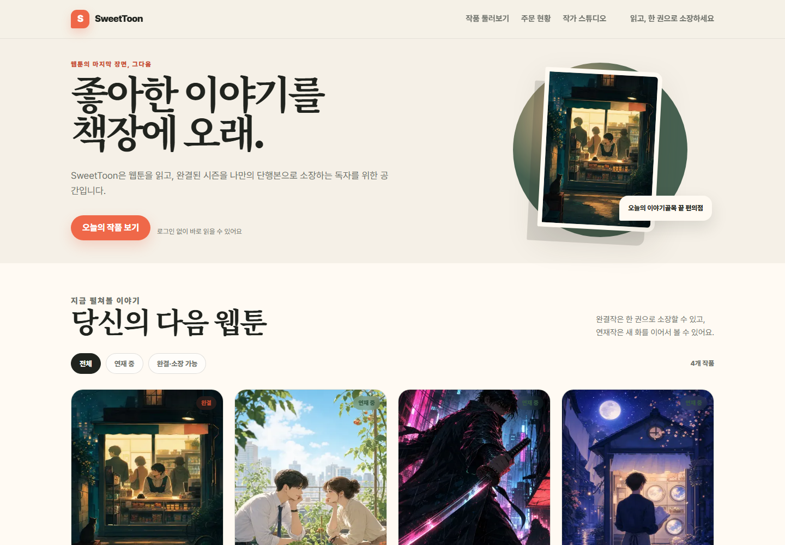
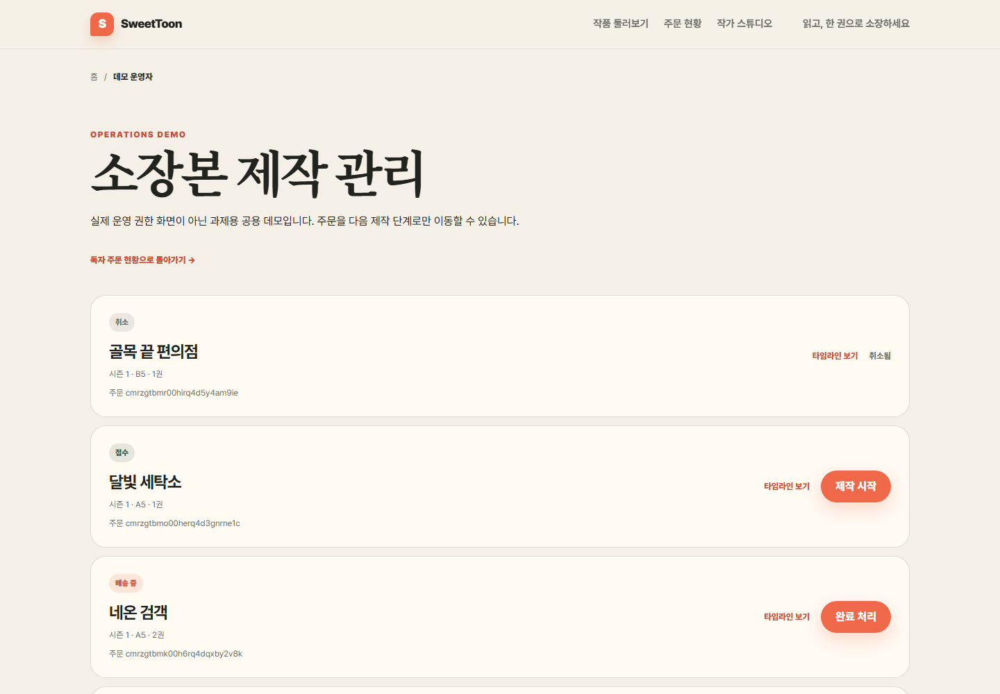

# SweetToon

읽던 웹툰을 세로 스크롤로 감상하고, 완결 시즌을 실물 단행본으로 소장할 수 있는 웹툰 플랫폼입니다.



## 기획 배경과 사용자

웹툰 독자는 작품을 디지털로 읽지만, 좋아하는 완결 시즌은 책장에 둘 수 있는
물건으로 소장하고 싶어 합니다. 반대로 개인 창작자는 연재 원고를 다시 정리해
인쇄용 콘텐츠로 접수하는 과정이 번거롭습니다. SweetToon은 두 요구를
`읽기 → 소장본 주문`과 `ZIP 원고 → 회차 발행`이라는 짧은 흐름으로 연결합니다.

- **핵심 사용자 — 웹툰 독자:** 작품을 발견하고 감상한 뒤 완결 시즌을
  한 권의 소장본으로 주문합니다.
- **보조 사용자 — 개인 창작자:** PNG/JPEG/WebP 원고가 든 ZIP/CBZ를 올려
  순서를 확인하고 에피소드로 발행합니다.
- **데모 역할 — 제작 운영자:** 주문을 허용된 다음 제작 단계로 이동시키고
  독자에게 보이는 타임라인을 확인합니다.

로그인 없는 공용 데모이므로 `/orders`와 `/operations/orders`는 개인 계정 화면이
아님을 UI에 명시하고 검색 색인에서도 제외했습니다. 실제 서비스에서는 인증과
역할별 접근 제어가 먼저 추가되어야 합니다.

## 핵심 사용자 흐름

1. 홈에서 전체·연재 중·완결/소장 가능 작품을 탐색합니다.
2. 작품 상세에서 회차를 골라 세로 스크롤로 감상합니다.
3. 완결 시즌의 판형·표지·수량을 선택하고 Mock 견적을 확인합니다.
4. 주문 후 제작 타임라인을 확인합니다.
5. 창작자는 ZIP/CBZ 원고를 자연 정렬된 미리보기로 검수한 뒤 발행합니다.
6. 데모 운영자는 접수·제작·배송·완료 순서만 허용된 상태 변경을 수행합니다.

| 웹툰 감상 | 제작 상태 관리 |
| --- | --- |
|  |  |

## UI/UX 설계 기준

- 네이버 웹툰처럼 작품 탐색 밀도와 익숙한 세로 스크롤 읽기 방식을 참고하되,
  종이색·코럴 톤과 편집숍 같은 시각 언어로 `소장`이라는 제품 정체성을
  구분했습니다.
- 작품이 4개인 데모에서 빈 요일 탭을 만들지 않고, 실제 데이터로 의미가 있는
  `전체 / 연재 중 / 완결·소장 가능` URL 필터를 사용합니다.
- 필터 상태를 query string에 보존해 뒤로가기·공유·서버 렌더링이 일치합니다.
- 홈·작품·뷰어·주문·스튜디오마다 목적에 맞는 헤더와 breadcrumb를 제공합니다.
- 로딩, 빈 데이터, 잘못된 ZIP, 중복 회차, 주문 실패와 동시 상태 변경을
  개발자 용어가 아닌 사용자 문장으로 구분합니다.
- 대표작 `달빛 세탁소` 첫 화는 8개의 일관된 AI 생성 컷으로 실제 감상 흐름을
  보여주고, 나머지 회차는 기능 검증용 플레이스홀더를 사용합니다.

각 공개 콘텐츠 페이지는 서버에서 초기 데이터를 렌더링합니다. 홈·작품·뷰어별
title, description, canonical, Open Graph/Twitter Card와 JSON-LD를 제공하고,
`robots.txt`, 동적 `sitemap.xml`, PNG 공유 이미지를 생성합니다.

## 구현 범위

- **Lv1 콘텐츠:** 작품 탐색, 상세, 세로 스크롤 뷰어, 이전·다음 화
- **Lv2 부가 기능:** 완결 시즌 견적·주문·영속 상태 타임라인
- **Lv2 창작 도구:** ZIP/CBZ 검증·자연 정렬 미리보기·회차 발행
- **가점 범위:** 운영자 상태 전이, 반응형 UI, SEO, 이미지 검증·WebP 파생,
  Mock 계약, 자동화된 Compose/E2E 검증
- **의도적 비대상:** 회원/권한, 결제, 실제 배송사, 알림, 추천·댓글,
  Komga 연동, 실제 Book Print API 호출

## Book Print API 정책

과제 안내에 따라 `api.sweetbook.com`에는 직접 요청하지 않습니다. 애플리케이션은 외부 서비스 없이
독립적으로 실행되며, 인쇄 연동 경계는 서버의 `PrintProvider` 인터페이스로 분리했습니다.

- 기본값과 유일하게 허용되는 구현은 `MockPrintProvider`입니다.
- `PRINT_PROVIDER=mock` 이외의 값은 서버가 명시적으로 거부하는 fail-closed 방식입니다.
- Mock은 견적·주문·상태 확인 계약을 구현하므로 이후 실제 연동이 허용되더라도 도메인 로직과 UI를
  바꾸지 않고 어댑터만 교체할 수 있습니다.
- 완결 시즌은 판형·표지·수량 선택, Mock 견적, 주문 접수와 제작 타임라인까지 체험할 수 있습니다.
  주문은 PostgreSQL에 보존되며 실제 결제나 외부 요청을 만들지 않습니다.
- 공개 데모에서는 실명·개인정보 입력을 안내로 제한하고, 주문 조회 API 응답에서 주문자 닉네임과
  제작 메모를 제외합니다.

## 실행

Docker Desktop이 실행 중인 환경에서 다음 명령으로 전체 애플리케이션을 시작합니다.

```bash
docker compose up --build
```

- 웹: http://localhost:3000
- API 상태 확인: http://localhost:4000/health
- PostgreSQL: localhost:5432

기본값만으로 `.env` 없이 실행됩니다. 포트가 이미 사용 중이면
`.env.example`을 `.env`로 복사하고 `WEB_PORT`, `SERVER_PORT`, `DB_PORT`를 변경합니다.
첫 실행에서는 Prisma 마이그레이션과 데모 데이터 생성이 자동으로 수행됩니다. 이후 재시작에서는 기존 데이터를 보존합니다.

바로 확인할 수 있는 경로:

- `/` — 독자 작품 탐색
- `/series/moonlight-laundry` — 대표 작품과 첫 화
- `/orders` — 공용 데모 주문 현황
- `/studio` — 창작자 ZIP/CBZ 업로드
- `/operations/orders` — 공용 데모 제작 상태 관리

## 구조

```text
web/      Next.js 16 + React 19
server/   Express 5 + Prisma 6 + Mock PrintProvider
db        PostgreSQL 16
```

웹, API, DB는 별도 컨테이너로 실행되지만 하나의 모노레포와 Docker Compose 실행 계약으로 관리합니다.
Next.js Route Handler 대신 독립 Express API를 둔 이유는 웹 외 클라이언트와 B2B API 확장을 고려한
API-first 경계를 보여주고, 이미지·압축 파일 처리와 웹 렌더링의 책임을 분리하기 위해서입니다.

PostgreSQL은 주문·상태 이벤트와 업로드 발행처럼 동시 쓰기가 있는 운영 전환을
고려해 선택했습니다. 의존성 주입은 프레임워크 없이 조립 지점에서 명시적으로
수행하고, `ReaderRepository`, `OrderRepository`, `PrintProvider` 인터페이스만
교체할 수 있게 두었습니다. 현재 트래픽 규모에서 별도 DI 컨테이너나 범용 factory,
애플리케이션 수준 connection pool 추상화는 복잡도만 늘리므로 Prisma의 pool과
작은 provider factory만 사용합니다.

## 개발 규약과 검증 하네스

- [`AGENTS.md`](./AGENTS.md) — 사람·Codex·Claude가 공유하는 아키텍처와 안전 규약
- [`docs/ROADMAP.md`](./docs/ROADMAP.md) — 남은 사용자 흐름과 비대상 범위
- [`docs/REVIEW_CHECKLIST.md`](./docs/REVIEW_CHECKLIST.md) — 과제 기준과 PR 리뷰 체크리스트
- `scripts/verify-web.ps1` — 의존성, audit, lint, Next.js production build
- `scripts/verify-server.ps1` — 의존성, audit, Prisma 검증, TypeScript build, Jest
- `scripts/smoke-compose.ps1` — 격리된 Compose 전체 기동과 Mock/API/SSR 스모크 검증
- `scripts/verify-e2e.ps1` — 격리된 Compose 환경에서 Chromium 사용자 흐름 검증

로컬 PowerShell 7 또는 Jenkins의 Windows PowerShell에서 전체 검증을 순서대로 실행합니다.

```powershell
pwsh -File scripts/verify-web.ps1
pwsh -File scripts/verify-server.ps1
pwsh -File scripts/smoke-compose.ps1
pwsh -File scripts/verify-e2e.ps1
```

Compose 스모크 스크립트는 `sweettoon-verify-*` 이름의 독립 project와 임의 호스트
포트를 사용하며 성공·실패 여부와 관계없이 자신이 만든 컨테이너와 볼륨을 정리합니다.
브라우저 E2E도 같은 방식으로 독립 DB와 업로드 볼륨을 만들고 URL 기반 작품 탐색,
독자 감상, 소장본 주문, 모바일 작가 스튜디오 흐름을 검증합니다. 실패하면
Playwright trace, 스크린샷, 비디오와 HTML 리포트를 남깁니다. Jenkins도 같은
스크립트를 호출하므로 로컬 검증과 CI 계약이 분리되지 않습니다.

## 구현된 API

- `GET /api/series?filter=all|ongoing|collectible` — 상태·소장 가능 작품 목록
- `GET /api/series/:slug` — 작품, 시즌, 에피소드 상세
- `GET /api/episodes/:id` — 에피소드 컷과 이전·다음 회차
- `POST /api/print-quotes` — 완결 시즌 페이지 수 기반 Mock 견적
- `POST /api/orders` — 멱등 요청 키를 사용한 소장본 주문 접수
- `GET /api/orders` — 데모 사용자의 주문 목록
- `GET /api/orders/:id` — 주문 사양과 상태 변경 타임라인
- `PATCH /api/orders/:id/status` — 순차적인 데모 제작 상태 변경
- `POST /api/studio/uploads` — ZIP/CBZ 검증과 자연 정렬 미리보기
- `GET /api/studio/uploads/:sessionId/pages/:pageId` — 만료되는 원고 미리보기
- `POST /api/studio/episodes` — 확인한 페이지 순서로 에피소드 등록
- `DELETE /api/studio/uploads/:sessionId` — 임시 업로드 취소·정리
- `GET /api/images/*` — 데모 및 업로드 이미지

요청 파라미터와 응답은 Zod 계약으로 검증합니다. 조회 라우트는 저장소 인터페이스에,
상태 규칙이 있는 주문 라우트는 service(use case)에 의존해 HTTP 테스트에서 DB 없이
경계 조건을 검증합니다.

## AI 활용과 데모 데이터

기획 대안 검토, 경계 조건 탐색, 구현과 코드 리뷰에 AI를 사용했습니다. 결과를
그대로 채택하지 않고 저장소 계약, 단위 테스트, Compose 스모크와 Playwright
사용자 흐름으로 재검증했습니다.

표지 4장과 `달빛 세탁소` 대표 1화 8컷은 이 과제를 위해 생성한 오리지널 데모
이미지입니다. 상업 만화나 개인 Komga 라이브러리의 이미지는 포함하지 않습니다.
출처와 가공 방식은
[`server/prisma/assets/covers/README.md`](./server/prisma/assets/covers/README.md)와
[`server/prisma/assets/episodes/README.md`](./server/prisma/assets/episodes/README.md)에
기록했습니다.

## 현재 한계

- 인증이 과제 범위 밖이어서 주문·운영자 화면은 공용 데모입니다. 주문 API 응답은
  주문자 닉네임과 메모를 제외하지만, 실제 서비스에는 소유권 검증이 필요합니다.
- Mock 인쇄 주문은 로컬 PostgreSQL 상태의 출발점만 제공합니다. 결제·배송 조회와
  외부 인쇄사 동기화는 구현하지 않았습니다.
- 대표 1화를 제외한 콘텐츠는 기능 확인용 플레이스홀더입니다.
- CSV 내보내기와 창작자용 시즌 일괄 가져오기는 핵심 사용자 흐름을 흐리지 않기
  위해 제외했습니다.

## CI

루트 `Jenkinsfile`은 다음 검증을 수행합니다.

1. 웹 의존성 설치, lint, production build
2. 서버 의존성 설치, Prisma schema 검증, TypeScript build, API·Mock provider 테스트
3. 격리된 Docker Compose 프로젝트에서 전체 서비스 기동 및 health check
4. Chromium에서 작품 탐색·독자·주문·스튜디오 핵심 흐름 E2E

CD는 CI가 검증한 동일 Git SHA만 개발 서버에 전달합니다.

## 개발 브랜치와 배포

- 기능 작업: `dev`에서 분기한 별도 branch/worktree
- 통합: 검증된 PR을 `dev`에 병합
- 개발 배포: `Jenkinsfile.deploy`이 `.48` Linux 노드에서 `docker-compose.prod.yml`을 적용
- 제출 후보: 검증된 `dev`를 `main`으로 승격

개발 배포는 기존 `traefik-net`에 연결되며 `sweettoon.katsuranbo.com` Host 규칙으로만 노출됩니다.
운영 DB 값은 Jenkins secret-file credential `sweettoon-prod-env`로 주입하고 저장소에는 커밋하지 않습니다.
CI 검증이 모두 성공하면 검증한 Git SHA를 `SweetToon-Deploy-Dev`에 전달합니다.
배포 작업은 체크아웃한 SHA가 전달받은 SHA와 다르면 중단하여, 검증되지 않은 최신
커밋이 우연히 배포되는 것을 방지합니다.
